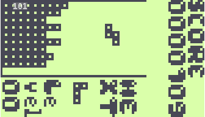

# Tetrino for Gamebuino
(fork from https://raw.githubusercontent.com/j0ff/tetrino)

## Description
A port of the EXCELLENT [Simple Tetris Clone](https://code.google.com/p/simple-tetris-clone/) to the Gamebuino platform.
Sound effects are included.

## Changes

* chaged controls
* added inf file
* recompiled for fresh library version

## Controls

* Rotate your Gamebuino by 90 degrees first!
* LEFT/RIGHT Arrows: move block left/right
* DOWN: move block down
* UP: drop block
* C: Return to Title Screen
* A: Pause game
* B: Rotate block

## Install game
Copy file bin/TETRINO.HEX bin/TETRINO.INF to your SD card.
